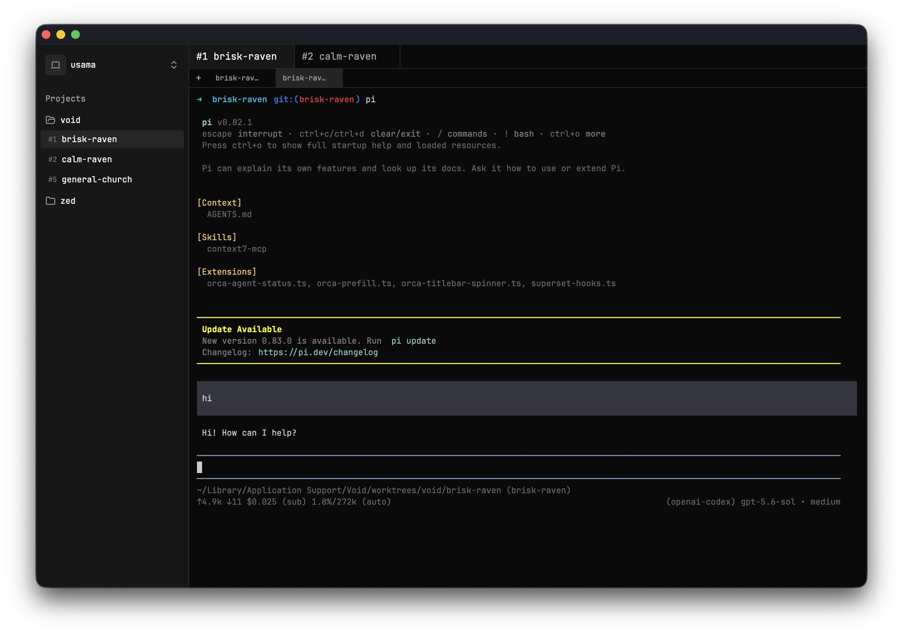

# Void



Void is an AI-first coding workspace for running coding agents concurrently in isolated Git branches and worktrees. It is built in Rust with [GPUI](https://gpui.rs/), Zed's GPU-accelerated UI framework.

The repository contains the native GPUI application shell, first-launch workspace and repository onboarding, managed branch/worktree creation, a repository sidebar, PTY-backed branch terminals, and SQLite persistence for Void's workspace hierarchy.

## Prerequisites

Void currently follows the Rust toolchain used by the pinned Zed revision in [`rust-toolchain.toml`](rust-toolchain.toml).

1. Install Rust with [rustup](https://rustup.rs/). Rustup installs the pinned toolchain automatically when a Cargo command runs in this repository.
2. Install the platform prerequisites listed in the official [GPUI documentation](https://gpui.rs/).
   - On macOS, install Xcode, launch it once to install its components, and install the Xcode command-line tools with `xcode-select --install`.
   - For Linux, FreeBSD, and Windows, consult the current GPUI and Zed platform documentation before installing system packages.

## Run

From the repository root:

```sh
cargo run -p void
```

A successful run opens a centered `1300 × 850` Void workspace window.

## Install

Published releases currently support Apple-silicon Macs. Download
`Void-aarch64.dmg` from the latest GitHub Release, open it, and drag **Void** to
**Applications**. Release builds are signed with a Developer ID certificate and
notarized by Apple.

Void checks the dedicated stable feed at
<https://github.com/usamaasfar/void/releases/latest/download/update.json> at
startup and hourly. It streams the DMG through GPUI's HTTP client, authenticates
its SHA-256 checksum and Apple signing identity, validates its bundle metadata
and arm64 executable, then installs it in the background. Automatic feed
failures remain quiet and retry hourly; download or installation failures show
one **Retry** interaction with the reason. Development builds and binaries run
outside a `.app` bundle never update themselves.

## Release

Follow the complete one-time setup and per-release checklist in
[`docs/how-to/release.md`](docs/how-to/release.md). The summary below describes
the repository contract.

A release is triggered only by pushing a semantic-version tag matching
`v*.*.*`. The tag must equal the `crates/void` package version; for example,
package version `0.1.0` releases from tag `v0.1.0`.

Configure these GitHub Actions secrets before pushing the first release tag:

- `APPLE_CERTIFICATE_P12_BASE64`: base64-encoded Developer ID Application
  certificate and private key in PKCS#12 format;
- `APPLE_CERTIFICATE_PASSWORD`: password for that PKCS#12 file;
- `KEYCHAIN_PASSWORD`: an ephemeral CI keychain password;
- `APPLE_SIGNING_IDENTITY`: full Developer ID Application identity;
- `APPLE_API_KEY`: App Store Connect API private key contents;
- `APPLE_API_KEY_ID`: App Store Connect key ID;
- `APPLE_API_ISSUER_ID`: App Store Connect issuer ID.

Also configure the public repository variable `APPLE_TEAM_ID` with the exact
10-character Team ID that owns the Developer ID certificate. The value is
compiled into release builds and is used to reject updates signed by any other
team.

After bumping and committing the package version, create and push the exact
matching stable tag:

```sh
git tag v0.1.0
git push origin v0.1.0
```

The workflow runs all repository checks, creates `Void.app` with bundle
identifier `com.void.desktop`, signs it with hardened runtime, builds and
notarizes `Void-aarch64.dmg`, and publishes the DMG, its human-readable
`Void-aarch64.dmg.sha256`, and `update.json` as a GitHub Release. Publication is
gated on signature verification, notarization, stapling, Gatekeeper assessment,
manifest generation, and the repository checks. Do not create the release
manually.

## Validate

```sh
cargo fmt --check
cargo check --workspace
cargo clippy --workspace --all-targets --all-features -- -D warnings
cargo test --workspace
```

## Repository layout

```text
.
├── crates/
│   ├── void/          # Thin native application crate and composition root
│   ├── void_terminal/ # PTY-backed terminal sessions and rendering
│   └── workspace/     # Application paths and workspace-domain persistence
├── assets/            # README and project imagery
├── docs/
│   ├── architecture.md
│   └── decisions/     # Durable architecture decision records
├── script/
│   └── bundle-mac     # macOS bundle, signing, DMG, and notarization
├── .github/workflows/
│   └── release.yml    # tag-only stable release workflow
├── Cargo.toml         # Workspace members, shared dependencies, and lints
└── rust-toolchain.toml
```

See [`docs/architecture.md`](docs/architecture.md) for the current boundaries and lifecycle.

## GPUI and Zed references

The scaffold is aligned with:

- official GPUI documentation: <https://gpui.rs/>;
- local Zed source at `/Users/usama/Documents/archive/zed`;
- Zed commit `5e549b871fb87d1038d9b1b242bf7d4d4e3b4d8f`;
- `crates/gpui/README.md`;
- `crates/gpui/examples/hello_world.rs`;
- `crates/gpui_platform/src/gpui_platform.rs`;
- Zed's root `Cargo.toml`, `rust-toolchain.toml`, and `rustfmt.toml`.

GPUI is pre-1.0 and changes frequently. The dependency revision is therefore pinned; update it only through an explicit, documented compatibility change.

## Local data

Void stores local state beneath the platform application-data directory:

```text
Void/
├── void.db
└── worktrees/
    └── <repository name>/
        └── <allocated branch name>/
```

Git branch separators are flattened only in the directory name, so `feature/auth` uses `feature-auth`. Existing and archived names or paths receive `-2`, `-3`, and later suffixes instead of being reused. The database schema and invariants are documented in [`docs/decisions/0002-persist-workspace-repository-branches.md`](docs/decisions/0002-persist-workspace-repository-branches.md).

## License

Void is licensed under GPL-3.0-only. GPUI is a separate dependency licensed under Apache-2.0.
